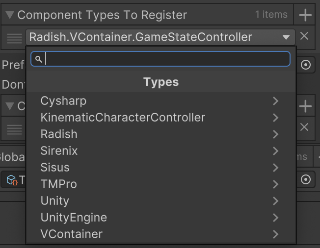

# SerializedType

SerializedType is a type that allows for C# type references to be serialized by Unity. There is also an inspector UI for selecting types for fields in the editor.

The types that are listed in the UI dropdown can be constrained using the `SerializedTypeSettings` attribute which allows specifying multiple base classes or interfaces that types must satisfy to appear in the list.

For example:
```csharp
[SerializedTypeSettings(typeof(IStartable), typeof(IAsyncStartable))]
[SerializeField] private SerializedType m_EntryPointType;
```
This will allow setting the field to a type that implements *either* the `IStartable` or `IAsyncStartable` interfaces. Currently, there is no way to specify more complex type requirements and this would require a rethinking of how these constraints are applied.

## Caveats

This feature is not something natively supported by Unity, so while quite reliable there are a number of considerations one must keep in mind.

- Unity will not automatically preserve the type stored in the field when performing code stripping i.e. when using IL2CPP. Types you know will be used in SerializedType fields can be marked with the `Preserve` attribute to ensure they are included in builds. If your project isn't using code stripping this shouldn't be a concern.
- Renaming a type in your codebase will not update any references in serialized values to match the new name. There are potential ways to make this work, but they are all too involved from a development standpoint to be worth pursuing. Just be careful when refactoring.
- If you are using a type from a versioned assembly, the version info is embedded into the type reference. This may or may not be an issue when resolving the type at runtime (I have not verified). Thankfully none of Unity's assemblies are versioned, and Assembly Definitions do not embed version info by default.

## Preview
